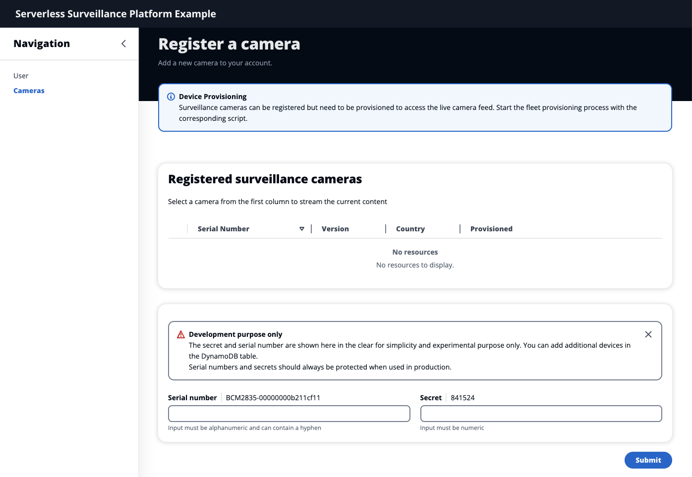
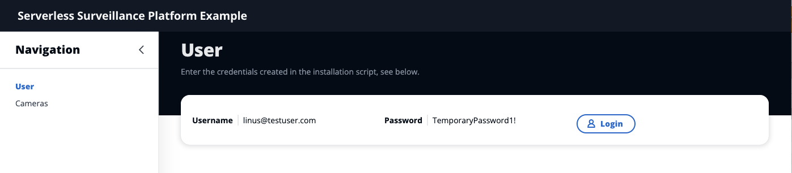
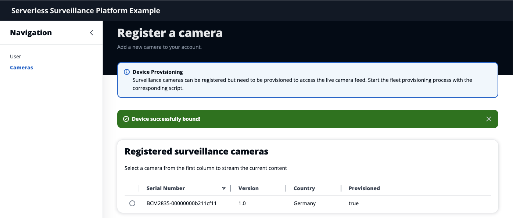
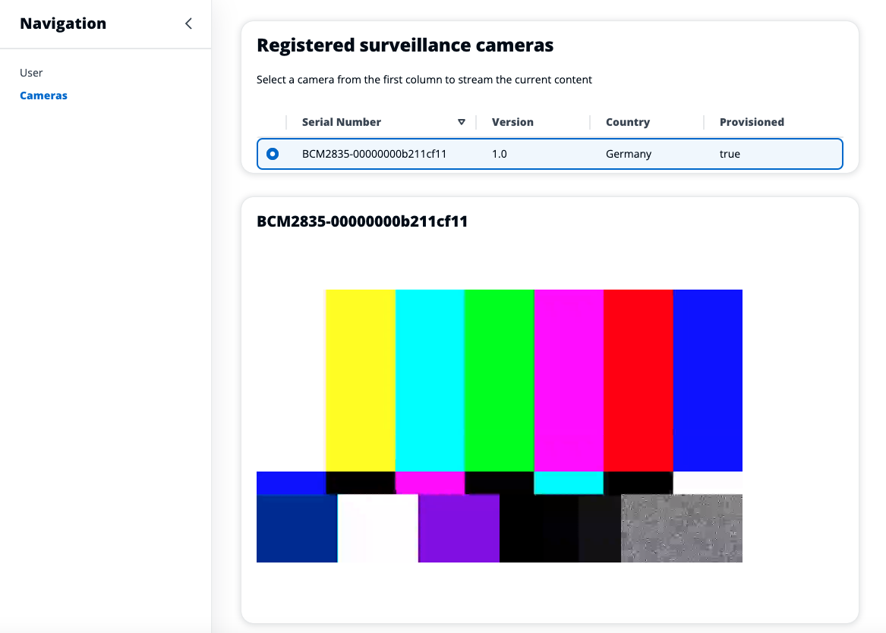
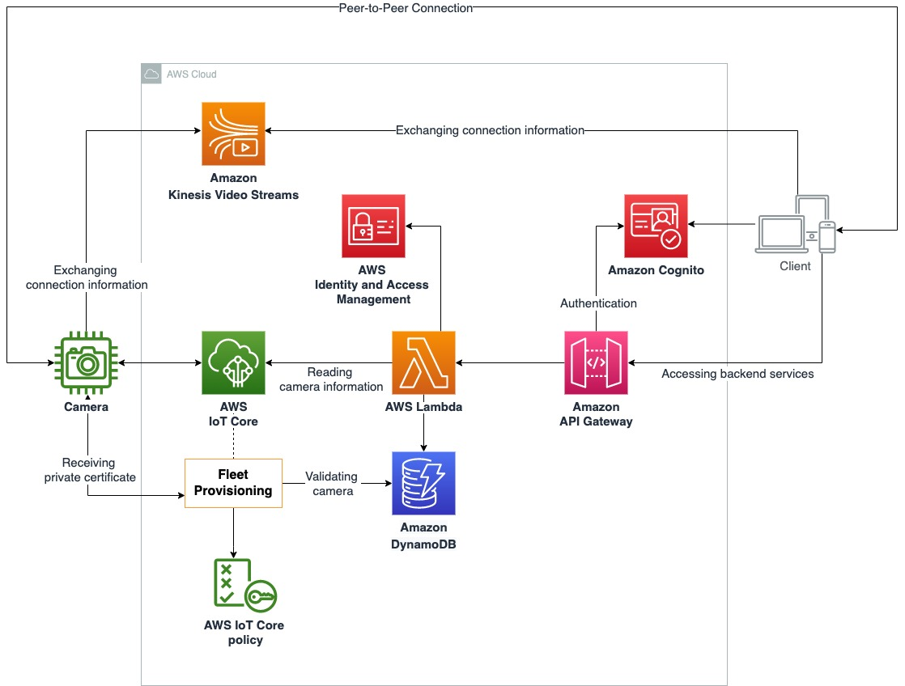
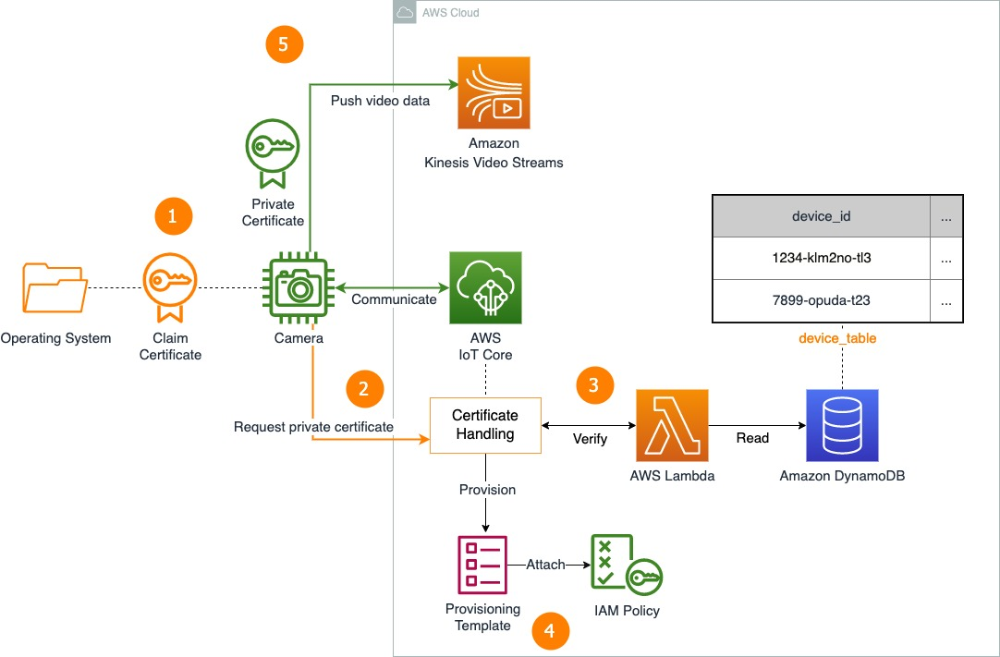
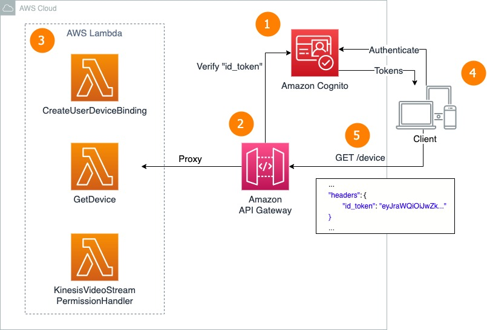
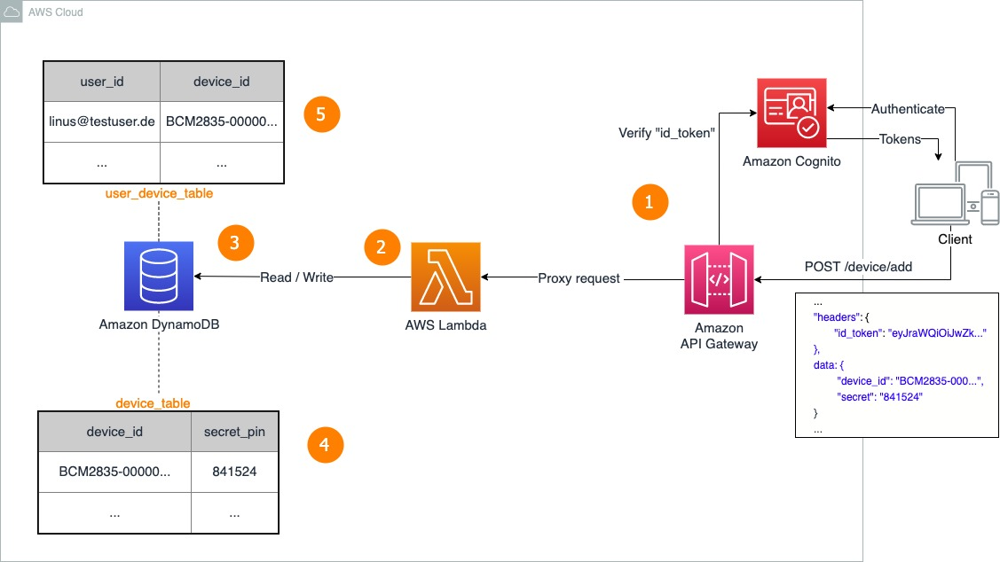
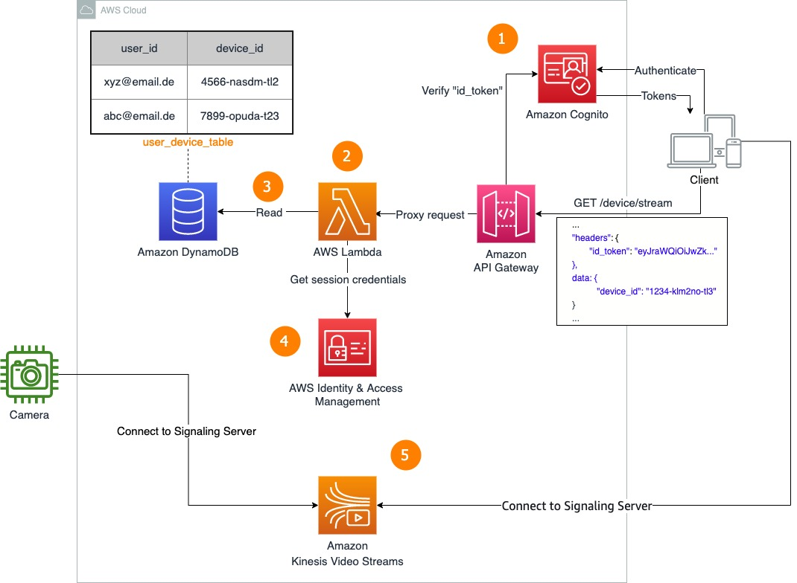

# Amazon Kinesis Video Streams serverless surveillance platform


You can find the related blogpost to this repository here: 
[Design considerations for cost-effective video surveillance platforms with AWS IoT for Smart Homes](https://aws.amazon.com/blogs/iot/design-considerations-for-cost-effective-video-surveillance-platforms-with-aws-iot-for-smart-homes/)

Deploying the infrastructure requires you to have sufficient privileges to do so.
Please [setup the AWS CLI](https://docs.aws.amazon.com/cli/latest/userguide/cli-chap-configure.html) beforehand.
You can find a detailed explanation to every building block in the [Solution Walkthrough](#solution-walkthrough).

**_This example is for experimental purposes only and is not production ready. The deployment of this sample can incur costs. Please ensure to remove infrastructure via the provided scripts when not needed anymore._**

----

## Supported Regions

**Please note that this example only works in the Amazon Kinesis Video Streams supported Regions which can be found here https://docs.aws.amazon.com/general/latest/gr/akv.html**


-----





---


1. [What the installation scripts do](#what-the-installation-scripts-do)
3. [Quick Start](#quick-start)
4. [How to clean up](#how-to-clean-up)
5. [Web Client Walkthrough](#web-client-walkthrough)
6. [Solution Walkthrough](#solution-walkthrough)

---

## What the installation scripts do

### Infrastructure

The script will deploy the required infrastructure, permissions and roles:

- Creates a S3 Bucket for the AWS Lambda functions.
- Builds the AWS Lambda functions, zips and uploads them to S3 Bucket.
- Creates Thing Type, Thing Group, Fleet Provisioning Template and Claim Certificates in IoT Core.
- Creates DynamoDB as "Manufacturing Database" that contains a device. (Credentials can be found in Web Application)
- Deploys Amazon Cognito with a test user and password. (Credentials can be found in Web Application)
- Amazon API Gateway with corresponding paths to forward requests to the AWS Lambda functions
- Creates configuration for the web application
- Creates configuration for the camera mock / raspberry


### Camera Mock

The script will deploy the required infrastructure, permissions and roles:

- Creates local files to automatically start the fleet provisioning process and the streaming to Amazon Kinesis Video Stream via WebRTC.
- Zips the local created files
- Creates a S3 Bucket and uploads the zip file
- Deploys an EC2 instance via CloudFormation `cfn-surveillance-camera-infrastructure.yaml` that downloads the .zip file and executes the fleet provisioning and media streaming.


------

## Folder Structure & Snippets


```
camera/
├─ scripts/
│  ├─ main.py
│  ├─ provisioning_handler.py
│  ├─ config.ini
│
├─ claim-certificates/
│
├─ service/
│  ├─ videostream.service
│  ├─ stream-video.sh
│
├─ cfn-surveillance-camera-mock-buckets.yaml
├─ cfn-surveillance-camera-mock.yaml
│
├─ install-mock.sh
├─ uninstall-mock.sh
```

The `install-mock.sh` is the entry point to create all related infrastructure and files of the EC2 camera mock.

The `uninstall-mock.sh` is the entry point to remove all related infrastructure and files of the EC2 camera mock.

The `cfn-surveillance-camera-mock-buckets.yaml` cloudformation template creates an S3 bucket that is used to store the scripts, claim-certificates and service folder in a zip file for the EC2 camera mock.

The `cfn-surveillance-camera-mock.yaml` cloudformation template creates infrastructure of an EC2 machine that will stream a sample video to Amazon Kinesis Video Streams.

The subfolder scripts contains the python scripts for provisioning new certificates based on the fleet provisioning by claim flow. The `config.ini` file is generated by the `./infrastructure/install-infrastructure.sh` script and contains information of the mock device. (see [code snippet](https://github.com/aws-samples/amazon-kinesis-video-streams-serverless-surveillance-platform/blob/main/infrastructure/install-infrastructure.sh#L130))

The claim-certificates subfolder is generated by the `./infrastructure/install-infrastructure.sh` script and contains the created claim certificates by the script. (see [code snippet](https://github.com/aws-samples/amazon-kinesis-video-streams-serverless-surveillance-platform/blob/main/infrastructure/install-infrastructure.sh#L54))

The service subfolder contains a Linux service `videostream.service` to run as a background progress and restart the `video-stream.sh` which is generated by the `install-mock.sh`. (see [code snippet](https://github.com/aws-samples/amazon-kinesis-video-streams-serverless-surveillance-platform/blob/main/camera/install-mock.sh#L33)).

The `video-stream.sh` executes the amazon-kinesis-video-streams-webrtc-sdk-c sample on the mock camera, which is downloaded and installed during the startup of the EC2 instance. (see [code snippet](https://github.com/aws-samples/amazon-kinesis-video-streams-serverless-surveillance-platform/blob/main/camera/cfn-surveillance-camera-mock.yaml#L101))

The folders scripts, claim-certificates, and service are zipped and uploaded to S3 to be available to the EC2 camera mock for download during startup. (see [code snippet](https://github.com/aws-samples/amazon-kinesis-video-streams-serverless-surveillance-platform/blob/main/camera/install-mock.sh#L48))


```
infrastructure/
├─ lambda/
│
├─ cfn-surveillance-camera-infrastructure.yaml
├─ cfn-surveillance-camera-buckets.yaml
│
├─ install-infrastructure.sh
├─ uninstall-infrastructure.sh
```

The `install-infrastructure.sh` is the entry point to create all related infrastructure and files of the backend services of the platform solution.
It also generates the configuration files for the web-client `.env` and camera `config.ini`.  (see [code snippet](https://github.com/aws-samples/amazon-kinesis-video-streams-serverless-surveillance-platform/blob/main/infrastructure/install-infrastructure.sh#L120))

The `uninstall-infrastructure.sh` is the entry point to remove all related infrastructure and files of the backend services of the platform solution.

The `cfn-surveillance-camera-buckets.yaml` cloudformation template creates an S3 bucket that is used to store the lambda functions a zip file for serverless api proxy pattern.

The `cfn-surveillance-camera-infrastructure.yaml` cloudformation template creates infrastructure of the backend services of the platform solution including Amazon Cognito, AWS Lambda, Amazon API Gateway, Amazon DynamoDB, AWS IoT Core and Amazon Kinesis Video Streams. 


```
web-client/
├─ src/
│  ├─ sub/
│  │  ├─ Camera.tsx
│  │  ├─ Login.tsx
│  ├─ util/
│  │  ├─ Backend.tsx
│  │  ├─ Video.tsx
│  │  ├─ WebRTCViewer.tsx
│
├─ .env
```

The configuration files for the web-client `.env` are created by the `./infrastructure/install-infrastructure.sh` script and contains the base url to the Amazon Api Gateway and Amazon Cognito. (see [code snippet](https://github.com/aws-samples/amazon-kinesis-video-streams-serverless-surveillance-platform/blob/main/infrastructure/install-infrastructure.sh#L120))

The `WebRTCViewer.tsx` component creates the connection to the Amazon Kinesis Video Streams service to consume via WebRTC the sample video stream from the camera mock.
The `Backend.tsx` component handles the api calls to the Amazon Api Gateway.
The `Video.tsx` is a wrapper component for the WebRTCViewer to display in the frontend.

The `Camera.tsx` component calls the backend functions to handle the camera binding.
The `Login.tsx` component handles the redirecting to the Amazon Cognito hosted UI, the receiving of the tokens, and the storing of the tokens within a cookie.

------

## Quick start

Please follow the instructions in the walktrough section of the corresponding blogpost on how to get started:
[Design considerations for cost-effective video surveillance platforms with AWS IoT for Smart Homes](https://aws.amazon.com/blogs/iot/design-considerations-for-cost-effective-video-surveillance-platforms-with-aws-iot-for-smart-homes/)

## How to clean up

Run the following script to remove the deployed infrastructure, permissions and roles.
```sh
cd infrastructure
sh ./uninstall-infrastructure.sh
```

Run the following script to remove the camera mock and its resources.
```sh
cd camera
sh ./uninstall-mock.sh
```

1. [Open Cloud9 in the AWS Management Console](https://console.aws.amazon.com/cloud9)
2. **Select** `surveillance-camera-ide`
3. **Click Delete**
4. Type **Delete** to agree.

---
## Web Client Walkthrough

1. Copy the `Username` and `Password` and select `Login` 




2. Enter the credentials, select a new password and setup a software mfa in the Cognito Hosted UI. [see authenticator apps](https://docs.aws.amazon.com/singlesignon/latest/userguide/mfa-types-apps.html)
3. Enter the provided `Serial number` and `Secret` and select **Submit** to bind the user to the provisioned camera. ([see binding users to cameras](#binding-users-to-cameras))

_Note: The secret and serial number are shown here in the clear for simplicity and experimental purpose only. You can add additional devices in the DynamoDB table.
Serial numbers and secrets should always be protected when used in production._


4. Once the camera mock provision status is `true`, select `BCM2835-00000000b211cf11` in the table. 
   1. Refresh the page to request a status update or if an error occurs



5. You will see the test stream from the camera mock as below.



***

# Solution Walkthrough

1.	[Seamless onboarding of cameras to AWS](#seamless-onboarding-of-cameras-to-aws)
2.	[Registering and verifying access to backend services](#registering-and-verifying-access-to-backend-services)
3.	[Binding users to cameras](#binding-users-to-cameras)
4.	[Create session policies for web client to access Kinesis Video Streams](#create-session-policies-for-web-client-to-access-kinesis-video-streams)
5.	[Pushing and consuming video data from the camera](#pushing-and-consuming-video-data-from-the-camera)

***
## Overview



***

## Seamless onboarding of cameras to AWS

You need a database with a `device_table` that holds information of the serial number of all the manufactured surveillance cameras. 
In this example, the serverless key-value database service Amazon DynamoDB is used to verify identities, to store user and device data.




This figure shows the onboarding flow of the surveillance cameras. Establish the first connection with the claim certificate (orange path). 
As soon as you verified the device and IoT Core provisioned a private certificate, establish the communication via this private certificate (green path).

1. The common bootstrap certificate (Claim Certificate) is received from IoT Core. (see `./camera/claim-certificate`) Place this certificate along with your OS and your scripts on each surveillance camera.
2. Configure the camera to connect with the bootstrap certificate to the IoT Core endpoint requesting a unique private X.509 certificate. (see `./camera/scripts/main.py`) Use the device’s serial number as client id. (see `./camera/config.ini`)
3. You use the created pre-provisioning hook function (see `./infrastructure/lambda/CheckDeviceManufactured/index.js`) to verify the device’s identity by looking up a device’s serial number or other secret in a pre-approved `device_table` in DynamoDB. (see [device_table in DynamoDB](https://console.aws.amazon.com/dynamodbv2/home#tables))
4. If the camera is an approved device, the fleet provisioning template sets up the device configuration and attaches AWS IAM policies and AWS IoT Core policies to the private certificate. A new thing name identical to the client id is registered in AWS IoT. (see [CameraProvisioningTemplate in AWS IoT](https://console.aws.amazon.com/iot/home#/provisioningtemplatehub)) 
5. The camera is now authorized with `KVSCameraCertificateBasedIAMRole` to connect to Kinesis Video Streams to push video data. (see [Certificates and Policies in AWS IoT](https://console.aws.amazon.com/iot/home?#/certificatehub)) 

***
## Registering and verifying access to backend services

The script builds the backend services based on this multi-tier serverless pattern where the logic layer comprises of AWS Lambda functions. This layer handles different aspects of your client, such as reading from databases, updating camera states and communicating with Kinesis Video Streams. Your users authenticate with Amazon Cognito, call Amazon API Gateway and proxy requests to AWS Lambda functions.



1.	You set up an Amazon Cognito User Pool and use the OAuth 2.0 authentication protocol. [(find your User Pool here)](https://console.aws.amazon.com/cognito/v2/idp/user-pools)
2.	You created a REST API with Amazon API Gateway and integrated Amazon Cognito with it.
3.	The REST API will proxy the request to the respective Lambda function. (see `./infrastructure/lambda`)
4.	The web application (see `./web-client`) implements Amazon Cognito by using the hosted UI of the service. You could also implement the logic by yourself using [Amazon Cognito Identity SDK for JavaScript.](https://docs.aws.amazon.com/AWSJavaScriptSDK/v3/latest/clients/client-cognito-identity-provider/index.html)
5.	The REST API has GET and POST paths using the received tokens in the headers. [(see Amazon API Gateway)](https://console.aws.amazon.com/apigateway/main/apis)

***
## Binding users to cameras

You need to create a user convenient and secure mechanism to create the user-device-binding. The camera should only be bound to one user at a time and a user should not be able to register multiple devices by guessing the device identifier. Here, you provide the unique device identifier of the camera to the user (i.e. with a QR-Code). You also provide the user with a secret that is associated with the unique device identifier of the camera.



1. Users enter the device identifier of their camera along with a secret pin in the web application. The input is validated with a JSON validation schema in the API Gateway. [The proxy pattern is known from above.](#registering-and-verifying-access-to-backend-services)
2. You use the id_token in the Lambda function to receive the unique identifier (see `./infrastructure/CreateUserDeviceBinding`).
3. The same Lambda function reads from the device_table and writes to the user_device_table.
4. It looks up the `device_id` in the `device_table` and verify the `secret` to prevent incorrect user device bindings.
5. It looks up the `device_id` in the `user_device_table`. If there is no related `device_id`, create a new entry. Otherwise, reject the request as the device is already bound.

***

## Create session policies for web client to access Kinesis Video Streams




1.	Authenticated users send a GET request comprising the `id_token` and `device_id`.
2.	Use the id_token in the Lambda function to receive the user unique identifier (i.e., email).
3.	Verify the `device_id` and `user_id` from the `user_device_table` in DynamoDB.
4.	On successful verification, call Identity & Access Management from the Lambda function to receive secret and access key with a session policy to access the stream with the `device_id`. Send the response to the client.
5.	The client connects to the Signaling Server on Amazon Kinesis Video Streams.

[Read more on isolating users with dynamically generated IAM Policies](https://aws.amazon.com/blogs/apn/isolating-saas-tenants-with-dynamically-generated-iam-policies/)

***
## Pushing and consuming video data from the camera

The [Kinesis Video Streams Producer Libraries for C++](https://docs.aws.amazon.com/kinesisvideostreams-webrtc-dg/latest/devguide/kvswebrtc-sdk-c.html) are build on the camera mock (see last block of `./camera/cfn-surveillance-camera-mock.yaml`)

A shell script executes the sample from the amazon-kinesis-video-streams-webrtc-sdk-c. 
(create the camera mock and see `./service/stream-video.sh`). 

This script will run as background service (see `./service/videostream.service`).

The web client uses the [WebRTC SDK in JavaScript for Web Applications](https://docs.aws.amazon.com/kinesisvideostreams-webrtc-dg/latest/devguide/kvswebrtc-sdk-js.html) to consume the video stream of the camera (see `./web-client/src/util/WebRTCViewer.tsx`)


1. The camera mock creates a Signaling Server in Amazon Kinesis Video Streams and connects to it. The web client will also connect to the Signaling Server.
2. The camera and the web client request the public ip addresses of each other via the STUN Server.
3. Interactive Connectivity Establishment (ICE) is a framework managing candidate discovery, connectivity checks, keepalives, and more. ICE uses STUN and/or TURN servers to determine ICE candidates comprised of public and private IP addresses and port numbers to use to connect.
4. The peers attempt to establish a peer-to-peer connection
5. The TURN server to relay the connection information is used as the fallback approach on peer-to-peer connection failure.

[Read more about the WebRTC here.](https://catalog.us-east-1.prod.workshops.aws/kinesis-video-streams/en-US/5-webrtc-introduction/1-webrtc)
